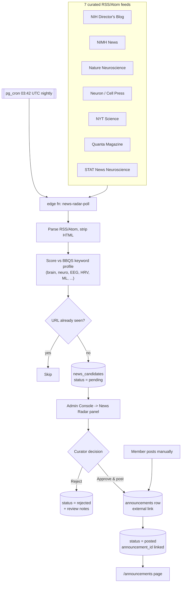

# News Radar — Automated Announcements Pipeline

The Announcements page is fed by two paths: **manual posts** by signed-in members, and
**News Radar**, a nightly poller that proposes science-news items for admin approval.

## Flow

Mermaid source

## Components

| Piece | Location | Role |
| --- | --- | --- |
| Poller | `supabase/functions/news-radar-poll/` | Fetch, parse, keyword-score, insert candidates |
| Schedule | `pg_cron` job, 03:42 UTC daily | Runs the poller unattended |
| Queue table | `public.news_candidates` | Pending / approved / rejected / posted |
| Review UI | `src/components/admin/NewsRadarPanel.tsx` | Filter by status, notes, one-click approve |
| Public page | `src/pages/Announcements.tsx` | Renders `announcements`, newest first |

## Scoring & de-duplication

- Case-insensitive substring match of item title + summary against the BBQS keyword list.
- `score` = number of distinct keyword hits; matched terms stored in `matched_keywords[]`.
- Items with zero hits are discarded, never stored.
- `url` is unique — re-polling the same feed is idempotent.

## Approval semantics

Approving inserts a row into `announcements` (`is_external_link = true`, link text
`Read on <source>`), then flips the candidate to `posted` and stores `announcement_id`,
`reviewed_by`, `reviewed_at`, and any `review_notes`. Rejections keep the row for
audit but never surface publicly.

## Tuning

Feeds and keywords are plain arrays at the top of `news-radar-poll/index.ts`.
Add a feed or a term and redeploy — no schema change required.
"Poll now" in the admin panel triggers an out-of-band run.
